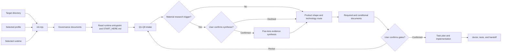

# GovernSeed

> Governance foundations for agent-native projects.

GovernSeed is a local-first governance bootstrap generator for
agent-native projects. It turns intent, decisions, roles, risk boundaries,
and evidence requirements into versioned, machine-checkable contracts
before implementation begins.

[](https://github.com/Eskasia/agent-governance-starter/actions/workflows/validate-starter.yml)
[](LICENSE)
[](package.json)

Formal brand: `Eskasia GovernSeed`

GovernSeed was previously developed as `agent-governance-starter`.
Existing commands, schemas, generated-project metadata, configuration
paths, and machine identifiers remain compatible during the transition.

The starter makes four things explicit:

- what the project is trying to achieve;
- which product shape and technology route were selected;
- which decisions, risks, and acceptance criteria remain open;
- what evidence is required before implementation or a public claim can proceed.

| At a glance | Value |
|---|---|
| Primary use | Bootstrap governance for a new or existing agent-assisted project |
| Input | Target directory, runtime selection, and governance profile |
| Output | Markdown governance documents, project-local decision and role data, runtime entrypoints, profile metadata, and doctor checks |
| Supported runtimes | Codex, Claude Code, Antigravity, or all three |
| Default profile | `base` |
| Runtime requirement | Node.js 20 or newer |
| Local network requirement | None for `init`, `doctor`, or deterministic test execution |
| Public CI boundary | No secrets, provider calls, or real agent-runtime calls |

## What this repository is — and is not

This repository is the reusable source starter. An initialized downstream project receives a tailored governance document set; it does not receive this repository's test harness or maintenance documentation.

It is:

- a project-intake and decision-governance bootstrapper;
- a source of canonical agent rules and thin runtime entrypoints;
- a profile-driven document generator;
- a local doctor, fixture, runtime-contract, and evidence-validation suite.
- a deterministic, project-local decision review and responsibility-assignment foundation.

It is not:

- an AI runtime framework or hosted service;
- an application, UI, backend, or deployment template;
- a PRD prompt pack;
- a multi-agent orchestrator;
- an Agent Runtime Framework, desktop app, Provider automation tool, Agent Marketplace, or Hosted Control Plane;
- proof that governance improves delivery, that a generated project is production-ready, or that anyone outside this repository has adopted it.

## How it works



The generated `AGENTS.md` is the canonical lifecycle owner for the intent and route gates. Claude and Antigravity files adapt that source; they do not redefine it.

## Quick start

### Prerequisites

- [Node.js](https://nodejs.org/) 20 or newer
- Git, when cloning the starter or running committed-artifact release checks

The `init` and `doctor` CLIs use Node.js built-ins and do not require `npm install`.

### Generate a base Codex project

```bash
git clone https://github.com/Eskasia/agent-governance-starter.git

node agent-governance-starter/scripts/init.mjs ./my-new-project \
  --agent codex \
  --profile base

node agent-governance-starter/scripts/doctor.mjs ./my-new-project
```

`init` preserves existing project files. When a destination already exists, the command reports `SKIP` instead of overwriting it.

### Generate all runtime entrypoints for a fullstack AI project

```bash
node agent-governance-starter/scripts/init.mjs ./my-ai-product \
  --agent all \
  --profile fullstack-ai

node agent-governance-starter/scripts/doctor.mjs --json ./my-ai-product
```

### Continue with the agent

Paste this as the first message after initialization:

```text
Read START_HERE.md and the runtime entrypoint for this agent. List files read, fixed documents present, conditional documents likely needed, product shape / technology route mode, and current blockers. Start Q1-Q9 intake one question at a time. Do not write code until intake, product shape / technology route, required docs, TASK_CONTRACT.md, and OPEN_LOOPS.md are confirmed.
```

Fresh templates intentionally produce doctor warnings until the project documents, route evidence, traceability ledgers, and open loops are filled.

## CLI reference

This project exposes local CLI contracts, not an HTTP API.

### `init`

```text
node scripts/init.mjs <target-directory>
  [--agent codex|claude|antigravity|all]
  [--profile base|fullstack-ai|macos]
  [--all]
```

| Option | Default | Behavior |
|---|---|---|
| `<target-directory>` | required | Directory to create or augment |
| `--agent` | `codex` | Generates the selected runtime entrypoint; `all` generates every supported entrypoint |
| `--profile` | `base` | Selects the profile manifest and its document set |
| `--all` | off | Copies every fixed and conditional Markdown template |
| `--help`, `-h` | — | Shows current options and available profiles |

`--all` means “copy every template,” not “activate every workflow.” In particular, a blank `RESEARCH_SYNTHESIS.md` is not evidence of user confirmation.

### `doctor`

```text
node scripts/doctor.mjs
  [--strict]
  [--json]
  [--profile base|fullstack-ai|macos]
  <project-directory>
```

| Mode | Use |
|---|---|
| Default | Inspect a fresh or in-progress project; warnings are reported without making every placeholder fatal |
| `--strict` | Treat warnings as failures for filled fixtures, reviews, and release checks |
| `--json` | Emit the machine-readable contract defined by `schemas/doctor-output.schema.json` |
| `--profile` | Override profile discovery when a project config is unavailable or intentionally replaced |

Without `--profile`, doctor reads `.agent-governance.json` and falls back to `base`.

### Decision and role foundation

Milestone 1 uses these terms as strict product contracts:

- **Governance Pack** — an optional collection of processes, rules, and checks that can only add restrictions or checks and cannot expand existing permissions.
- **Policy Compiler** — a pure-local compiler that converts confirmed risks, project rules, and Governance Packs into Agent-tool-readable settings. It is designed here for a later milestone and is not implemented.
- **Attestation** — a comparison of declared policy, compiled output, and observable target settings; it does not mean an Agent Runtime necessarily obeys that policy. It is designed here for a later milestone and is not implemented.
- **Adapter** — a thin layer that converts neutral governance data into a tool-specific format; it must not repeat core decision logic or execute an Agent.
- **Deliberation** — four AI seats making multi-round proposals, critiques, verification, and synthesis about one decision; its result is decision advice, not human approval.
- **Role Assignment** — selection of the minimum necessary delivery, review, and verification responsibilities from task, risk, stack, and acceptance data; a role cannot acquire extra tools, network, credentials, or write access.
- **Evidence Graph** — a logical evidence graph made from stable IDs and references, represented in JSON and Markdown and validated by doctor without adding a graph database.

Deliberation seats use the `DLB-*` namespace only. Delivery roles use the
`ROLE-*` namespace only. The complete logical lineage is:

```text
SRC → REQ → DEC → AC → TASK → ROLE → POL → EVD → ATT
```

`OPEN_LOOP` may reference an unconfirmed `SRC`, `REQ`, `DEC`, `TASK`, or `EVD`.
Milestone 1 implements `SRC` through `ROLE` plus evidence references. `POL` and
`ATT` remain later, separately reviewed work.

```text
agent-governance assess <project> [--task <id>] [--json]
agent-governance deliberate plan <project> --decision <id> [--json]
agent-governance deliberate import <project> --file <path> [--json]
agent-governance deliberate confirm <project> --decision <id> --file <path> [--json]
agent-governance roles assign <project> --task <id> [--catalog <path>] [--override <path>] [--json]
agent-governance pack list <project> [--json]
```

These commands use only explicit project files and deterministic rules. They do
not call an external model, run an Agent, access credentials, install plugins,
write user-global settings, or use the network. JSON mode writes one object to
stdout; diagnostics go to stderr. Stable exit codes are `0` success, `1`
incomplete governed input, `2` usage error, `3` schema or semantic validation
failure, `4` a fail-closed safety, policy, reference, permission, or replay
block, and `5` bounded project-local I/O failure.

## Generated project

### Generated base project tree

```text
my-new-project/
├── .agent-governance.json
├── .agent-governance/
│   ├── .gitignore
│   ├── risk-profile.json
│   ├── source-lock.json
│   ├── packs.lock.json
│   ├── decisions/
│   ├── role-assignments/
│   └── local/                 # ignored: raw/private runtime material only
├── AGENTS.md
├── CONTEXT.md
├── OPEN_LOOPS.md
├── PROJECT_BRIEF.md
├── README.md
├── SPEC.md
├── START_HERE.md
├── TASK_CONTRACT.md
└── TECH_STACK.md
```

### Core outputs

| Output | Responsibility |
|---|---|
| `README.md` | Generated project entrypoint, read order, and doctor command |
| `START_HERE.md` | Runtime-aware read order, Q1-Q9 intake, profile documents, and gate-before-code instructions |
| `.agent-governance.json` | Machine-readable generator, profile, agent, and included-document metadata |
| `PROJECT_BRIEF.md` | Problem, user, MVP, product shape, and confirmed source evidence |
| `SPEC.md` | Scope, non-goals, requirement revisions, and yes/no acceptance criteria |
| `CONTEXT.md` | Shared language, roles, data objects, and ambiguity controls |
| `TECH_STACK.md` | One primary technology route, excluded routes, evidence, risks, and re-evaluation triggers |
| `TASK_CONTRACT.md` | Executable tasks with inputs, tools, outputs, validation, evidence, and non-goals |
| `OPEN_LOOPS.md` | Unresolved decisions, ownership, status, lineage, and confirmation state |
| `AGENTS.md` | Canonical project rules and lifecycle ownership for the intent and route gates |
| `.agent-governance/risk-profile.json` | Explicit task risk facts, open questions, and the project permission ceiling |
| `.agent-governance/source-lock.json` | Exact external source commit, license, mode, hash, and attribution metadata |
| `.agent-governance/packs.lock.json` | Enabled Pack summaries, exact project-local artifact paths, and pinned source metadata |
| `.agent-governance/decisions/DEC-*/` | Content-bound decision, plan, imported result, and separate human confirmation records |
| `.agent-governance/role-assignments/TASK-*.json` | Deterministic, reason-coded responsibility selections and append-only overrides |

Import persists only `imported`; it never supplies approval. A separate
project-local declared-human-confirmation record, bound to the exact decision,
plan, and imported-result hash, transitions the stored result to
`human-confirmed`. Raw prompts, complete model output, provider sessions,
cookies, credentials, and provider traces belong only in ignored
`.agent-governance/local/` storage and are blocked from committable artifacts.

### Conditional documents

Conditional files are selected by profile, copied with `--all`, or recommended when project facts match their trigger.

| Surface | Documents | Trigger examples |
|---|---|---|
| UI and design | `UI_SPEC.md`, `DESIGN_SYSTEM.md`, `DESIGN_REVIEW.md` | UI, screenshots, design extraction, visual review, beta, or launch |
| Data and integration | `DATA_MODEL.md`, `API_CONTRACT.md`, `ENV_CHECKLIST.md` | Database, auth, permissions, API, webhook, deployment, or third-party service |
| Research | `RESEARCH_SYNTHESIS.md` | Material evidence conflict, a high-impact decision, credible route divergence, or explicit multi-view research |
| AI system | `AGENT_RUNTIME.md`, `RAG_DESIGN.md`, `EVAL_PLAN.md`, `AI_SECURITY_REVIEW.md` | Production agent, retrieval, model evaluation, tool use, PII, or prompt-injection risk |
| Delivery | `PRESENTATION_BRIEF.md`, `TESTER_HANDOFF.md`, `MACOS_RELEASE_CHECKLIST.md` | Presentation, tester handoff, macOS permissions, signing, notarization, or release |
| Architecture | `docs/adr/*.md` | Expensive or hard-to-reverse architecture, data, deployment, or service decision |

The core required-document policy lives in [`startup/02-required-project-docs.md`](startup/02-required-project-docs.md). The complete conditional inventory and trigger routing are maintained in [`profiles/`](profiles/) and [`templates/README.md`](templates/README.md).

## Profiles

Profiles are document manifests, not application scaffolds.

| Profile | Extends | Added outputs |
|---|---|---|
| `base` | — | Eight required governance documents, `START_HERE.md`, `.agent-governance.json`, and selected runtime entrypoints |
| `fullstack-ai` | `base` | `DATA_MODEL.md`, `API_CONTRACT.md`, `ENV_CHECKLIST.md`, `AGENT_RUNTIME.md`, `RAG_DESIGN.md`, `EVAL_PLAN.md`, `AI_SECURITY_REVIEW.md` |
| `macos` | `base` | `MACOS_RELEASE_CHECKLIST.md`, `TESTER_HANDOFF.md` |

Profile definitions live in [`profiles/`](profiles/). The scripts resolve inheritance from those JSON manifests instead of hardcoding document lists.

## Runtime adapters

| Selection | Generated entrypoint | Rule boundary |
|---|---|---|
| `codex` | `AGENTS.md` | Canonical source of truth |
| `claude` | `AGENTS.md` and `CLAUDE.md` with `@AGENTS.md` | Claude Code thin adapter |
| `antigravity` | `AGENTS.md`, `.agents/AGENTS.md`, and `.agents/skills/*/SKILL.md` | Antigravity thin adapter plus bootstrap and validation skills |
| `all` | All of the above | One canonical rules source with all thin adapters |

The root [`ANTIGRAVITY.md`](ANTIGRAVITY.md) in this source repository is a compatibility and migration note, not the generated Antigravity entrypoint.

## Governance workflow

The starter's default sequence is:

1. **Intake** — ask Q1-Q9 one question at a time to define the problem, observable success, failure conditions, non-goals, constraints, acceptance, deployment, technology preferences, and scale.
2. **Conditional research** — recommend synthesis only when a material trigger exists; wait for user confirmation before executing it.
3. **Product and route decision** — use either `user-declared route` or `ai-recommended route`, document one first-version product shape and one primary technology route, and record exclusions and re-evaluation conditions.
4. **Design the work** — complete fixed documents and the conditional documents justified by project facts.
5. **Plan** — create a 5–10 step task contract with validation and explicit non-goals.
6. **Implement** — execute one reviewed step at a time after the user confirms the gates.
7. **Validate and hand off** — run relevant tests, doctor checks, release checks, and the documented handoff workflow.

Q1-Q9 is intake, not a demand that the user already know the technology. The selected product shape and technology route remain documented decisions; the generator does not silently choose or implement them.

See [`startup/01-bootstrap-gates.md`](startup/01-bootstrap-gates.md) and [`workflows/product-shape-tech-route.md`](workflows/product-shape-tech-route.md) for the canonical flow.

## Conditional research synthesis

The research workflow is recommended when at least one decision-relevant signal exists:

- supplied evidence materially conflicts;
- the decision is high-impact or difficult to reverse;
- multiple credible routes remain;
- important cross-domain implications are missing;
- the user explicitly requests multi-perspective research.

The agent reports the trigger, the affected decision, and the risk of skipping research. It then asks whether to create and complete `RESEARCH_SYNTHESIS.md`.

When confirmed, the workflow:

- treats practitioner, scholar, skeptic, economist, and historian as analytical lenses—not simulated credentials or five human experts;
- keeps supplied material primary and distinguishes sourced claims, reasonable inferences, and unresolved gaps;
- maps contradictions, consensus, evidence strength, and cross-lens connections;
- produces a concise executive layer and a detailed review layer;
- self-checks confidence, weak links, decision sensitivity, and academic rigor without claiming Stanford affiliation or review.

Doctor reports whether the file is present and warns unless the activation record contains exactly one `User decision: confirmed` or `User decision: declined`. Workflow policy treats only `confirmed` as activation. The workflow is not Q10, a default hard gate, runtime orchestration, a release gate, or proof that a conclusion is true.

See [`workflows/research-synthesis.md`](workflows/research-synthesis.md) and the [`RESEARCH_SYNTHESIS.md` template](templates/conditional/RESEARCH_SYNTHESIS.md).

## Validation

### Choose the smallest relevant check

| Change or question | Command |
|---|---|
| JavaScript syntax | `npm run check` |
| Starter consistency and release-unit integrity | `npm run validate` |
| Generated base project | `npm run smoke:base` |
| Fullstack profile plus all adapters | `npm run smoke:fullstack` |
| Filled adoption fixtures and expected doctor JSON | `npm run fixtures` |
| Runtime entrypoint contracts | `npm run runtime:proof` |
| Governance and rule lifecycle | `npm run test:governance` |
| Decision, role, schema, and artifact safety | `npm run test:decision-role` |
| Governance-impact harness mechanics | `npm run test:governance-impact` |
| Privacy-negative paths | `npm run test:privacy` |
| Complete deterministic local suite | `npm run ci` |

Detailed commands and release semantics are in [`VALIDATION.md`](VALIDATION.md).

In a Git checkout, release validation requires every release artifact to exist in and match `HEAD`. `npm run validate` and `npm run ci` fail closed on untracked, index-only, staged, or unstaged release-unit drift because that drift is not reviewed release evidence.

### Fixture examples

Fixtures are filled, synthetic local adoption proofs. They show that different template packs can satisfy strict doctor checks; they are not production projects or external adoption evidence.

| Fixture | Coverage | Expected doctor contract |
|---|---|---|
| [`base-minimal`](examples/template-adoption/base-minimal/) | Fixed base documents | [`doctor.json`](examples/template-adoption/base-minimal/expected/doctor.json) |
| [`fullstack-ai-saas`](examples/template-adoption/fullstack-ai-saas/) | Data, API, environment, agent, RAG, eval, and AI security | [`doctor.json`](examples/template-adoption/fullstack-ai-saas/expected/doctor.json) |
| [`macos-beta-handoff`](examples/template-adoption/macos-beta-handoff/) | macOS release and tester handoff | [`doctor.json`](examples/template-adoption/macos-beta-handoff/expected/doctor.json) |

### Evidence surfaces

These checks answer different questions and must not be combined into one claim:

| Surface | What it checks | What it does not prove |
|---|---|---|
| Project doctor | Required documents, content quality, conditional hints, routing, and traceability | Product correctness or production safety |
| Fixture checks | Coherent filled examples and stable doctor JSON | External adoption |
| Runtime proof | Minimal first-response contract for generated Codex, Claude, and Antigravity entrypoints | Live-model quality or governance effectiveness |
| Governance-impact evaluator | Deterministic mechanics for comparing the same synthetic task in baseline and governed arms | That governance improves delivery |

## Runtime Proof

Runtime proof defaults to mock mode. Public CI explicitly forces mock mode:

```bash
npm run runtime:proof
npm run runtime:proof:mock
```

Real runtime proof is an explicit, synthetic-only maintainer action and fails closed when the matching CLI or required safety capability is unavailable:

```bash
RUNTIME_PROOF_REAL=1 npm run runtime:proof
```

See [`docs/runtime-proof.md`](docs/runtime-proof.md) for mode selection, contracts, safety boundaries, and non-claims.

## Governance Impact

The governance-impact evaluator compares the same committed synthetic task in baseline and governed arms after intake is complete. It has its own preregistration, privacy, containment, comparability, and claim gate. Its offline controls validate harness behavior only; they do not prove that governance improves delivery.

```bash
npm run test:governance-impact
npm run validate:governance-impact
npm run eval:governance
```

See [`docs/governance-impact-eval.md`](docs/governance-impact-eval.md) for the frozen CLI contract, fail-closed runtime matrix, scoring, claim thresholds, and non-claims.

## Repository map

| Path | Responsibility |
|---|---|
| [`AGENTS.md`](AGENTS.md) | Canonical maintenance rules for this source starter |
| [`startup/`](startup/) | Mandatory agent behavior, Q1-Q9 gates, and required-document policy |
| [`workflows/`](workflows/) | Conditional workflow routing and decision methods |
| [`templates/fixed/`](templates/fixed/) | Always-generated governance document templates |
| [`templates/conditional/`](templates/conditional/) | Triggered, profile-selected, or `--all` document templates |
| [`templates/runtime/`](templates/runtime/) | Generated runtime entrypoint material |
| [`profiles/`](profiles/) | Inheritable document manifests |
| [`prompts/`](prompts/) | Pasteable first prompts for supported runtimes |
| [`schemas/`](schemas/) | Doctor, project-document, runtime, and governance-impact JSON contracts |
| [`catalogs/`](catalogs/) | Minimal built-in governance responsibilities; no persona library |
| [`scripts/`](scripts/) | Init, umbrella governance CLI, doctor, validation, smoke, runtime-proof, and evaluator CLIs |
| [`tests/governance/`](tests/governance/) | Doctor, rule-lifecycle, and traceability tests |
| [`tests/decision-role/`](tests/decision-role/) | Decision/role fixtures, schema contracts, CLI behavior, artifact safety, and doctor integration |
| [`tests/runtime/`](tests/runtime/) | Runtime first-response fixtures and contracts |
| [`tests/governance-impact/`](tests/governance-impact/) | Synthetic scenarios, deterministic scorer, adapters, and containment tests |
| [`tests/privacy/`](tests/privacy/) | Negative privacy and unsafe-input regression tests |
| [`examples/template-adoption/`](examples/template-adoption/) | Filled synthetic project packs and expected doctor JSON |
| [`docs/research/source-adoption-matrix.md`](docs/research/source-adoption-matrix.md) | Exact research commits, adopted/rejected scope, licenses, and attribution |
| [`THIRD_PARTY_NOTICES.md`](THIRD_PARTY_NOTICES.md) | Required attribution and future-copying boundary |
| [`.github/`](.github/) | CI workflows, contribution templates, and release-note configuration |
| [`docs/index.md`](docs/index.md) | Complete documentation index |

For a new maintainer, read in this order:

1. [`README.md`](README.md)
2. [`startup/00-agent-start-here.md`](startup/00-agent-start-here.md)
3. [`startup/01-bootstrap-gates.md`](startup/01-bootstrap-gates.md)
4. [`startup/02-required-project-docs.md`](startup/02-required-project-docs.md)
5. the relevant file under [`workflows/`](workflows/)

## Security and claim boundaries

- Never commit API keys, tokens, cookies, private keys, `.env` files, deployment credentials, raw tester identifiers, private prompts, customer data, raw model output, tool traces, or unredacted evidence.
- Generated documents record secret names and ownership, never secret values.
- Committable decision and role artifacts contain normalized metadata and
  bounded synthesis only; ignored local storage is never evidence.
- Public CI uses synthetic fixtures, deterministic checks, and forced mock runtime proof without credentials.
- Real execution paths are explicit, synthetic-only, and fail closed on privacy, containment, persistence, schema, or cleanup uncertainty.
- A passing fixture, doctor run, runtime smoke test, or offline evaluator control is not proof of production readiness, external adoption, universal suitability, or governance effectiveness.
- Security review of a generated downstream project remains the downstream project's responsibility.

Report vulnerabilities through the private path described in [`SECURITY.md`](SECURITY.md).

## Contributing

1. Fork the repository and create a focused feature branch.
2. Make the smallest change that satisfies the documented contract.
3. Update templates, routing, schemas, tests, and docs together when the public surface changes.
4. Run the relevant checks, ending with `npm run ci` for public-ready changes.
5. Open a pull request using [the repository template](.github/pull_request_template.md).

Contribution rules for workflows, templates, runtime entrypoints, fixtures, and evaluator evidence are in [`CONTRIBUTING.md`](CONTRIBUTING.md). Planned work and explicit non-goals are in [`ROADMAP.md`](ROADMAP.md).

## FAQ

### Does this generate application code?

No. It generates governance documents and runtime entrypoints. Application architecture and implementation begin only after intake, route decisions, required documents, task contracts, open loops, and user confirmation are complete.

### Can I initialize an existing directory?

Yes. `init` creates missing files and skips existing destinations. Review the command output and run doctor afterward; preservation does not mean existing documents satisfy the current contract.

### Why does doctor warn immediately after initialization?

Fresh templates contain fields that the project and user still need to fill. Default mode reports that work in progress; strict mode intentionally fails on warnings.

### Does `--all` activate every conditional workflow?

No. It copies every fixed and conditional Markdown template. Activation still depends on project facts and user confirmation. Research synthesis requires an explicit activation record.

### Does runtime proof show that governance works?

No. Runtime proof checks generated entrypoint behavior. Governance-impact evaluation is separate, and its offline controls do not support an effectiveness claim.

### Is there a hosted service or HTTP API?

No. The supported product surface is a set of local Node.js CLIs, file manifests, Markdown templates, and JSON schemas.

### Which document should I read next?

Users of a generated project start with `START_HERE.md` and their runtime entrypoint. Maintainers of this source repository use [`docs/index.md`](docs/index.md).

## Community

| Area | Link |
|---|---|
| Issues | [Bug and feature templates](.github/ISSUE_TEMPLATE/) |
| Pull requests | [Pull request template](.github/pull_request_template.md) |
| Security | [Security policy](SECURITY.md) |
| Contributing | [Contribution guide](CONTRIBUTING.md) |
| Code of conduct | [Code of conduct](CODE_OF_CONDUCT.md) |
| Roadmap | [Public roadmap](ROADMAP.md) |
| Release notes | [Release-note configuration](.github/release.yml) |

## License

MIT — see [`LICENSE`](LICENSE).
