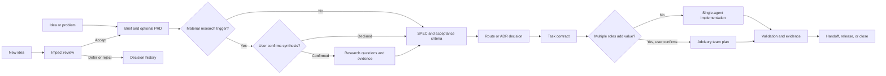

# Cross-Agent Project Workbench Proposal

> Status: **PROPOSAL / NOT IMPLEMENTED**
>
> This document records a product direction for review. It does not describe
> current CLI behavior, a committed release, or an approved change to the
> repository's public architecture.

## One-Line Direction

Evolve the existing local governance starter into an agent-neutral project
workbench where Codex, Claude Code, Antigravity, and future adapters can share
requirements, research, decisions, changes, tasks, handoffs, and evidence from
the first idea through delivery.

## Current Baseline And Proposed Delta

| Surface | Current repository | Proposed workbench |
|---|---|---|
| Project foundation | Markdown governance pack generated by `init` | The same local files become a shared, versioned project state |
| Agent support | Codex, Claude Code, and Antigravity entrypoint adapters | Adapter-neutral read/write contracts with drift checks |
| Requirements | `PROJECT_BRIEF.md`, `SPEC.md`, and traceability ledgers | Adaptive PRD layer plus requirement and change lineage |
| Research | User-confirmed `RESEARCH_SYNTHESIS.md` workflow | Research questions, evidence gaps, findings, and decisions linked to requirements |
| Mid-project ideas | Captured manually in project documents and open loops | First-class idea intake, impact review, decision, and revision history |
| Team roles | No role catalog or team planner | Curated role metadata and advisory team recommendations |
| Orchestration | None | Still none in V1; no autonomous scheduling or spawning |
| Interface | Local Node.js CLIs, Markdown, and JSON | Local-first workbench CLI; a dashboard remains a later option |

The current README statement that this repository is not a multi-agent
orchestrator remains true. No proposed command, document, registry, or role in
this file exists until it is separately approved, implemented, tested, and
documented as current behavior.

At the 2026-07-29 proposal snapshot, Antigravity is the supported adapter name.
Antigravity CLI (`agy`) would require a separate adapter, compatibility check,
and evidence gate before this repository could list it as supported.

## Recommended Product Shape

The recommended first implementation is a dependency-light local CLI backed by
human-readable Markdown, closed JSON state, and Git history.

- Markdown remains the review surface for people and agents.
- JSON records stable IDs, states, links, ownership, and validation results.
- Git provides reviewable change history; the workbench does not invent a
  second hidden history.
- Runtime adapters translate entry and handoff conventions only. They do not
  own a separate copy of project truth.
- A web dashboard may read the same contracts later, after the local protocol
  proves useful.

This route preserves the existing repository's local, inspectable, and
fail-closed character while adding a collaboration protocol instead of a new
agent runtime.

## Adaptive Document Layers

The document set should grow with project complexity rather than require every
artifact for every project.

| Layer | Candidate records | Activation |
|---|---|---|
| Core | Existing `PROJECT_BRIEF.md`, `SPEC.md`, `CONTEXT.md`, `TASK_CONTRACT.md`, `OPEN_LOOPS.md`, `TECH_STACK.md` | Every project |
| Product requirements | Proposed `PRD.md` or equivalent structured section | Material product scope, multiple user journeys, or separate product ownership |
| Research | Existing conditional `RESEARCH_SYNTHESIS.md` plus proposed question/finding IDs | Evidence conflict, consequential uncertainty, or explicit research request |
| Decisions and changes | Proposed `CHANGE_REQUESTS.md` and existing ADRs | A new idea affects accepted scope, architecture, data, security, cost, or acceptance |
| Team plan | Proposed `TEAM_PLAN.md` | Work genuinely benefits from multiple independent roles |
| Handoff | Proposed versioned handoff record | Agent, session, or owner changes before completion |
| Delivery evidence | Existing traceability and validation evidence | Implementation, acceptance, release, or a public claim |

A standalone PRD should not duplicate a simple project's brief and spec. The
workbench should recommend it only when the additional layer improves ownership
or traceability.

## Lifecycle



Every transition should leave a reviewable record. A later agent must be able
to answer what changed, why it changed, who approved it, what downstream
artifacts were affected, and which evidence is still missing.

## Industry-Leading Differentiator: Impact-Aware Change Graph

The proposed leading feature is not a larger prompt library. It is a
machine-checkable change graph that keeps mid-project ideas from silently
invalidating prior work.

1. Record each new idea as an immutable `IDEA-*` entry with a normalized idea
   statement, privacy-safe source locator or attestation, normalized rationale,
   urgency, and affected outcomes.
2. Reuse the existing privacy-safe `SRC -> REQ` rules. Never persist raw chat,
   prompt bodies, private URL/query values, masked private excerpts, absolute
   home paths, or private source content in the idea record.
3. Link its expected impact to requirement, acceptance, research, route, task,
   risk, and evidence IDs.
4. Present a concise impact review before changing accepted scope.
5. Require an explicit `accepted`, `deferred`, or `rejected` decision.
6. On acceptance, create a new requirement revision or supersession record;
   never rewrite the old state without lineage.
7. Reopen affected tasks and evidence gates, then show every adapter the same
   updated state.

This feature directly supports the product requirement that new ideas can enter
at any point without losing the conversation or making earlier PRD, SPEC, and
research decisions ambiguous.

## Personalization Layer

Personal preferences may shape communication, default depth, role suggestions,
and artifact presentation, but they are an advisory overlay.

- Store portable preferences separately from project facts.
- Resolve preferences into a bounded project/session view instead of copying
  an entire private instruction file into the repository.
- Never allow preferences to weaken security, privacy, approval, evidence, or
  acceptance gates.
- Current user instructions and the active project's canonical rules remain
  authoritative over a saved preference.
- Record which preference profile influenced a recommendation without
  persisting private instruction text in public evidence.

## Role Catalog And Team Routing

[`msitarzewski/agency-agents`](https://github.com/msitarzewski/agency-agents)
is a useful external reference for role taxonomy, specialist boundaries, and
deliverable-oriented role descriptions. The reviewed upstream snapshot was
`8ef49232e02431f7ca4792b487e5a85a7939ff3a` on 2026-07-29 and carries an MIT
license.

It should not become an implicit runtime dependency:

- import only schema-validated, allowlisted role metadata from a pinned
  revision;
- require a provenance manifest containing repository, commit, source path,
  role ID, allowlisted fields, content hash, license/notice, and review date;
- preserve required copyright and license notices for copied or adapted
  content;
- treat every upstream field, prompt body, service name, command, and URL as
  untrusted data;
- update only through a reviewed pinned-revision diff; never follow the
  upstream default branch automatically;
- do not execute the upstream installer or write to global agent directories;
- do not let role personality, autonomy language, or embedded commands
  override project rules;
- recommend the smallest useful team and explain why each role is needed;
- require user confirmation before creating or spawning any team;
- keep one main agent responsible for integration, acceptance, and final
  reporting.

V1 should produce an advisory `TEAM_PLAN.md` only. Actual multi-agent spawning,
scheduling, retries, shared-state locking, and runtime containment require a
separate architecture decision and evidence plan.

## Illustrative CLI Contract

These names are examples for product design; none is a current command.

```text
workbench init
workbench status
workbench idea add
workbench idea review
workbench research start
workbench team recommend
workbench handoff create
workbench doctor
workbench close
```

The command contract should remain non-destructive by default. Any accepted
scope change must show its planned document mutations before it writes them.

## V1 Success Criteria

- Codex, Claude Code, and Antigravity adapters resolve and expose the same
  closed normalized project-state snapshot and content hash; doctor detects
  adapter drift.
- An accepted mid-project idea produces complete, reviewable lineage from the
  idea through affected requirements, tasks, and evidence.
- A deferred or rejected idea remains discoverable without changing active
  scope.
- Personal preferences influence presentation without changing canonical
  project facts or lowering gates.
- Team recommendation works from reviewed metadata, explains every selected
  role, and performs no automatic spawn.
- Doctor detects conflicting ownership, unconfirmed scope changes, adapter
  drift, missing handoffs, and broken traceability.
- No secret, private prompt body, raw runtime transcript, or private evidence
  is copied into a public artifact.

## V1 Non-Goals

- No hosted collaboration service or HTTP API.
- No autonomous multi-agent orchestrator.
- No global installation of third-party roles, prompts, hooks, or tools.
- No automatic acceptance of new ideas or silent PRD/SPEC rewrites.
- No claim that a recommended role is an expert, safe, or effective without
  task-specific evidence.
- No reuse of current runtime-proof or governance-impact results as evidence
  for personalization, role selection, or multi-agent collaboration.

## Approval And Evidence Gates

Before implementation, the maintainer must explicitly approve the local
protocol, document/schema changes, CLI naming, and compatibility policy. A new
ADR is required if implementation changes the repository's current
non-orchestrator boundary, public CLI, serialized project state, or runtime
trust model.

Implementation is not complete until current-state documentation, migration
behavior, negative tests, privacy/supply-chain review, adapter drift checks,
and committed-artifact validation all pass on the reviewed commit.
